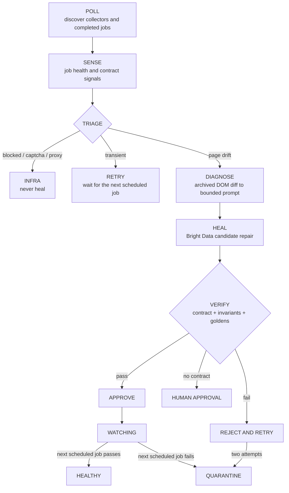

# ANANSI

**A guarded self-healing control plane for Bright Data scraper fleets.**

Bright Data Scraper Studio can generate a repair for a broken scraper, but an
operator still has to notice the failure, explain it, and decide whether the
repair is safe. ANANSI closes that loop:

1. discovers collectors and reads completed jobs;
2. detects hard failures and plausible-but-wrong output;
3. diagnoses page drift from archived DOM snapshots;
4. asks Scraper Studio to produce a candidate repair;
5. verifies preview rows against contracts, invariants, and golden records; and
6. approves a passing repair or rejects and quarantines a failing one.

ANANSI is a **monitor, not a scheduler**. It never starts a collection. Bright
Data owns collection cadence, while ANANSI observes the jobs that already ran.
The write-side adapter deliberately has no trigger method; see
[ADR-004](docs/decisions/004-monitor-not-scheduler.md).

## Safety model

- **No blind auto-approval.** Candidate repairs stop at Bright Data's approval
  gate and must pass deterministic verification.
- **Access failures are never healed.** Blocks, captchas, and proxy failures are
  routed to infrastructure handling rather than code generation.
- **Two failed repairs quarantine the collector.** This caps spend and prevents
  an unattended repair loop.
- **No-contract collectors remain human-gated.** They are monitored for platform
  failures, but ANANSI will not approve a repair without data to verify.
- **The next scheduled job confirms production behavior.** A promoted collector
  remains in `watching` until Bright Data's next real run passes.

## Architecture



Detailed design:

- [Architecture](docs/architecture.md)
- [Data contracts and detection](docs/data-contract.md)
- [Architecture decisions](docs/decisions/)
- [Bright Data integration notes](docs/brightdata-notes.md)

## Requirements

- Node.js 22 or newer
- npm 10 or newer
- A Bright Data API key with access to the collectors being monitored
- The Bright Data CLI for the `real` heal adapter
- Docker with Compose for container deployment

## Configuration

Copy the environment template and fill in the required values:

```bash
cp .env.example .env
```

| Variable | Default | Purpose |
|---|---|---|
| `BRIGHTDATA_API_KEY` | none | Required for collector discovery and job history |
| `ANANSI_ADAPTER` | `real` | `real` uses the Bright Data CLI; `fake` keeps writes offline |
| `ANANSI_POLL_SECONDS` | `10` | Job-history polling interval |
| `ANANSI_CONTRACTS` | `contracts` | Directory containing optional YAML contracts |
| `ANANSI_DATA` | `data` | Runtime state, snapshots, job ledger, and audit log |
| `GEMINI_API_KEY` | none | Optional LLM prompt generation; deterministic fallback otherwise |
| `ANANSI_CONSOLE_USERNAME` | `anansi` | Console HTTP Basic Auth username in production |
| `ANANSI_CONSOLE_PASSWORD` | none | Required by the production container |

Contracts are optional overlays keyed by `collector_id`. A collector without a
contract is still discovered and monitored, but its repair remains at the human
approval gate because ANANSI has no trustworthy output specification to apply.
Copy [the example contract](contracts/examples/lab-storefront.yaml) into
`contracts/`, then replace its collector ID and canary URLs.

## Development

Install both the backend and console dependencies:

```bash
npm ci
npm ci --prefix apps/console-ui
```

Run the complete validation suite:

```bash
npm run check
```

Useful development commands:

```bash
npm run monitor             # monitor worker
npm run console             # console on http://localhost:4700
npm run lab                 # optional Mutation Lab on http://localhost:4600
npx tsx scripts/seed-demo.ts
```

The fake adapter replaces only the write seam. Collector discovery and job
history always use Bright Data's REST API, so `BRIGHTDATA_API_KEY` is required
in both modes:

```bash
BRIGHTDATA_API_KEY=... ANANSI_ADAPTER=fake npm run monitor
```

## Container deployment

The default Compose file runs only the production services: the agent and the
authenticated console.

```bash
docker compose up --build -d
```

The console is bound to `127.0.0.1:4700` by default. Put it behind an
authenticated TLS reverse proxy before exposing it beyond the host.

The deliberately breakable Mutation Lab is not part of the production stack.
Start it only when evaluating the repair loop:

```bash
docker compose -f docker-compose.yml -f docker-compose.demo.yml up --build
```

See [the Coolify deployment guide](docs/deploy-coolify.md) and
[the operations guide](docs/operations.md) for authentication, backups,
quarantine recovery, and safe shutdown procedures.

## Bright Data integration

| Bright Data primitive | ANANSI usage |
|---|---|
| Collector and job REST APIs | Discover the fleet and read jobs that already completed |
| Dataset and per-input error APIs | Evaluate output and recover row-level failure causes |
| `tag_html()` | Capture scraper-visible HTML when the scraper emits it |
| `scraper heal` | Generate a candidate repair from a bounded diagnosis prompt |
| `awaiting_approval` and `preview_result` | Hold the candidate while verification runs |
| `scraper approve --auto-save` | Publish only a verified repair |
| `scraper approve --reject` | Discard a failing candidate before retrying |

The real adapter is implemented in
[packages/adapters/brightdata/real.ts](packages/adapters/brightdata/real.ts);
the offline write adapter is
[packages/adapters/brightdata/fake.ts](packages/adapters/brightdata/fake.ts).

## Repository layout

| Path | Purpose |
|---|---|
| `apps/agent/` | Polling monitor, incident driver, archive, and operator commands |
| `apps/console/` | Read-only console API and SSR fallback |
| `apps/console-ui/` | React console |
| `apps/ui/` | Optional, deliberately breakable Mutation Lab |
| `packages/core/` | Pure sensing, diagnosis, and verification engines |
| `packages/adapters/` | Bright Data, storage, and LLM I/O |
| `contracts/` | Optional per-collector data contracts |
| `scraper/` | Example Scraper Studio implementation |
| `test/` | Offline unit and integration tests |

## Operational limits

- Run exactly one agent replica against a data volume. The file-backed job
  ledger is not a distributed lock.
- Back up the data volume. Bright Data retains source results for a limited
  period, while ANANSI's incident and snapshot store is the long-term record.
- Plain HTTP archive captures are lower fidelity than Bright Data's browser
  rendering. JS-heavy, geo-gated, and challenged pages are marked
  low-confidence and are not used to generate confident repairs.
- The console exposes collected values and incident evidence. Keep
  authentication enabled and restrict network access.

## Development disclosure

AI coding assistants were used during development. Architecture, statistical
choices, verification rules, and production changes remain reviewable in the
ADRs, tests, and commit history.
