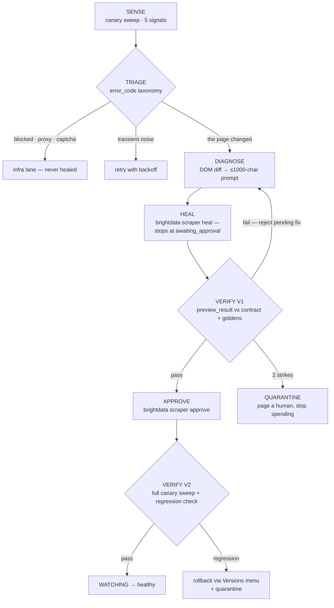

# ANANSI

**An immune system for your scraper fleet.**

Bright Data's Scraper Studio can heal a broken scraper — but only after a human notices the
breakage, writes the diagnosis in plain English, and approves the fix. ANANSI closes that loop:
it notices (including when a scraper returns *plausible wrong data* with no error), writes the
diagnosis itself from a DOM diff, drives Bright Data's own healer, verifies the proposed fix
against pinned golden records, and only then promotes it. Every incident is logged, costed, and
reversible.

Built for **Into the Scrape-Verse** (WeMakeDevs × Bright Data, Aug 17–23, 2026).

> One-line pitch: *Bright Data made scrapers that can heal. Anansi makes scrapers that know
> they're sick — and can prove the cure worked.*

## Demo video

**Link: TBD** — recorded during build week; beat-by-beat script in
[docs/demo-script.md](docs/demo-script.md). The kill shot at 0:40 is the silent-injection
mutation: the scraper returns 200, valid JSON, and a confidently wrong price — and the golden
band catches what null-checking never could.

### Screenshots

<!-- screenshot: console — incident trace (vertical stage timeline, credits + duration per node) -->
<!-- screenshot: console — split diff (last-good DOM vs mutated DOM beside the proposed code diff) -->
<!-- screenshot: Mutation Lab /__control panel, one button per mutation -->
<!-- screenshot: Scraper Studio IDE with scraper/lab-scraper.js source (tag_html / collect visible) -->

## The loop



Full walkthrough in [docs/architecture.md](docs/architecture.md); the five detection signals
and the goldens discipline in [docs/data-contract.md](docs/data-contract.md).

## Quickstart

```bash
npm install
npm test                 # 70 offline tests: sense/verify engines, incident driver, Lab, adapters

npm run lab              # Mutation Lab on :4600 — break it from /__control
npx tsx scripts/seed-demo.ts   # drive a full M2 incident through the fake adapter

npm --prefix console-ui install && npm run ui:build   # build the React console (once)
npm run console          # console on :4700 — React SPA if built, SSR fallback if not

ANANSI_ADAPTER=fake npm run scheduler   # the loop, fixture-first — the no-credits path
ANANSI_ADAPTER=live npm run scheduler   # rehearsal: real fetches of a running Lab, simulated heals
npm run scheduler                        # the real thing (brightdata CLI logged in)
```

Hosting it: `docker compose up --build` runs the whole stack (Lab, console, agent), and
[docs/deploy-coolify.md](docs/deploy-coolify.md) is the Coolify walkthrough — two public URLs,
one for the storefront and one for the console.

Everything develops fixture-first: `ANANSI_ADAPTER=fake` swaps in a Bright Data adapter that
replays banked `heal.json` responses, so the console, gates, and tests never touch the network
and spend no credits. `ANANSI_ADAPTER=live` is the middle rung — *rehearsal mode* — which
fetches a running Lab for real and parses it with the scraper's own selectors, but simulates the
heal; the console flags it with a `rehearsal` badge and stamps every simulated diff, so it can
never be mistaken for a platform run. The real path additionally needs the `brightdata` CLI logged in and the
`collector_id` from `scraper create` filled into
[contracts/lab-storefront.yaml](contracts/lab-storefront.yaml) (it ships as `null` until that
wiring lands). `examples/structured-output.json` shows the scraper's collected rows and a
closed incident record (Rule 9).

## How Bright Data Scraper Studio is used

Scraper Studio is not an integration here — it is the substrate. Every stage of the loop is
built from a Studio primitive:

| Studio primitive | How ANANSI uses it | Where |
|---|---|---|
| `scraper create` | The scraper is hand-authored — interaction + parser code written for the Studio IDE, not generated | [scraper/lab-scraper.js](scraper/lab-scraper.js) |
| `scraper run --sync` | Canary sweeps: 3–5 single-URL runs per cadence tick against pinned known-stable URLs | [shell/scheduler.ts](shell/scheduler.ts), [adapters/brightdata/real.ts](adapters/brightdata/real.ts) |
| `tag_html()` snapshots | Tagged on every page load; Scraper Studio surfaces the tag as a `page_html` output field (plus an auto-added `page_html_url`), which the adapter seam normalises — the stored last-good/current pair feeds the DOM diff | [scraper/lab-scraper.js](scraper/lab-scraper.js), [core/diagnose/](core/diagnose/) |
| `error_code` taxonomy | Every code routes to a triage lane: **heal** (the page changed) · **infra** (`blocked`, `proxy*` — never healed, [ADR-003](docs/decisions/003-blocked-never-healed.md)) · **retry** · **dead** · **config** | [core/sense/triage.ts](core/sense/triage.ts), [docs/brightdata-notes.md](docs/brightdata-notes.md) |
| `scraper heal` | Driven with an **auto-generated prompt** built from the DOM diff — symptom, located change, expected output — hard-capped at the CLI's 1000 chars. Never `--auto-approve` | [core/diagnose/prompt.ts](core/diagnose/prompt.ts), [shell/incident.ts](shell/incident.ts) |
| `awaiting_approval` + `preview_result` | Heal stops at the platform's own gate; V1 judges the preview rows (attributable via the collected `input.url`) against contract, invariants, goldens, and a hardcode detector | [core/verify/v1.ts](core/verify/v1.ts) |
| `scraper approve` / `--reject` | Approve only after V1 passes; a failed V1 **rejects the pending fix first** (the CLI's documented retry flow), then re-heals with the failure in evidence | [shell/incident.ts](shell/incident.ts), [ADR-002](docs/decisions/002-approval-gate-stays.md) |
| `collector_id` | Declared in the contract, threaded through every CLI call, and joined (as the scraper ⇄ collector pair) across store state, incident records, and console views | [contracts/lab-storefront.yaml](contracts/lab-storefront.yaml), [shell/main.ts](shell/main.ts), [adapters/store/index.ts](adapters/store/index.ts) |

Every one of these calls goes through a single adapter interface implemented twice:
[adapters/brightdata/real.ts](adapters/brightdata/real.ts) shells out to the `brightdata` CLI;
[adapters/brightdata/fake.ts](adapters/brightdata/fake.ts) replays banked fixtures. The loop,
gates, console, and tests all run today against the fake; pointing the same code at a live
account is the `scraper create` + `collector_id` wiring described in the Quickstart.

## Judging criteria → where to look

| Criterion | Where to look |
|---|---|
| "Solves a clear, useful problem" | The silent-lie failure mode: a scraper returning 200 + valid JSON + a wrong number. [docs/mutations.md](docs/mutations.md) M2, the golden-band signal in [core/sense/goldens.ts](core/sense/goldens.ts), video 0:00–1:00 |
| "Original approach to web-data collection" | First closure of Bright Data's *own* heal workflow into an autonomous gated loop, with the diagnosis prompt auto-written from a DOM diff ([core/diagnose/prompt.ts](core/diagnose/prompt.ts)). Prior art sized honestly below |
| "Complete, reliable, well-structured implementation" | Pure core / adapter shell ([docs/architecture.md](docs/architecture.md)) · 51 offline tests (`npm test`, [test/](test/)) · pre-declared scope tiers ([CUTS.md](CUTS.md)) · 3 ADRs ([docs/decisions/](docs/decisions/)) |
| "Bright Data Scraper Studio central" | The table above — every loop stage is a Studio primitive; [scraper/lab-scraper.js](scraper/lab-scraper.js) is hand-authored for the Studio IDE |
| "Accounts for site changes, missing data, extraction failures" | The Mutation Lab ([lab/](lab/), [docs/mutations.md](docs/mutations.md)) breaks the site on demand; 5 signals + triage lanes ([docs/data-contract.md](docs/data-contract.md), [core/sense/triage.ts](core/sense/triage.ts)); quarantine + rollback paths |
| "Demo explains problem, workflow, structured output, product" | [docs/demo-script.md](docs/demo-script.md) beat by beat; [examples/structured-output.json](examples/structured-output.json) (collected rows + closed incident record); the console screens |

## Folder map

| File | What it is |
|---|---|
| [docs/architecture.md](docs/architecture.md) | The five-stage loop, component boundaries, adapter design |
| [docs/data-contract.md](docs/data-contract.md) | Contract schema, detection signals, golden records |
| [docs/mutations.md](docs/mutations.md) | Mutation Lab spec — the 3 shipping mutations + stretch |
| [docs/brightdata-notes.md](docs/brightdata-notes.md) | Verified platform facts: CLI, API, latency, credits, error routing |
| [docs/runbook.md](docs/runbook.md) | Day-by-day build schedule, D1 hour by hour |
| [docs/deploy-coolify.md](docs/deploy-coolify.md) | Hosting: three containers, two public URLs, rehearsal vs. real |
| [docs/demo-script.md](docs/demo-script.md) | The 3-minute video, beat by beat, with fallback strategy |
| [docs/prep-checklist.md](docs/prep-checklist.md) | Everything to finish before Aug 17 |
| [docs/decisions/](docs/decisions/) | ADRs — drafted now so writing them later is transcription |
| [CUTS.md](CUTS.md) | Pre-declared scope tiers — the cuts are decided while calm |
| `core/` | Pure engines: sense (5 signals) · diagnose (DOM diff → prompt) · verify (V1/V2 gates) |
| `adapters/` | The only I/O: Bright Data CLI (real + fixture fake) · store · LLM |
| `shell/` | Scheduler (state machine, budget guard) + incident driver |
| `contracts/` | Per-scraper data contracts: canaries, goldens, invariants, `collector_id` |
| `lab/` | Mutation Lab storefront (Dockerfile + vercel.json) — see [docs/mutations.md](docs/mutations.md) |
| `console/` | Console server: incident trace + split diff + fleet strip (SSR fallback) |
| `console-ui/` | React SPA for the console (Vite; served by `console/` once built) |
| `scraper/` | Hand-authored Scraper Studio source (Rule 5) |
| `scripts/` | `seed-demo.ts` (fixture demo) · `harness.ts` (overnight heal characterization) |
| `test/` | 51 offline tests over sense, diagnose, verify, the incident driver, and the Lab |
| `examples/` | Committed example structured output (Rule 9) |

## The claim, sized honestly

Self-healing scraping is not a new category — Kadoa ships a commercial loop, and the academic
field of wrapper verification (Kushmerick, AAAI 1999) described distributional output-checking
twenty years ago. ANANSI's delta is specific: it is the first system to close **Bright Data's
own** heal workflow — `scraper heal` / `scraper approve`, which today require a human at every
step — into an autonomous, gated, verified loop built natively from Scraper Studio primitives
(`tag_html` snapshots, the `error_code` taxonomy, the approval gate). Prior art is cited, not
hidden.

## AI usage disclosure

Hackathon Rule 10 requires disclosure of AI-assistant use. This project is planned and will be
built with AI coding assistants (Claude). The architecture, statistical design (tolerance bands
+ CUSUM over PSI — see [ADR-001](docs/decisions/001-why-not-psi.md)), verification-gate logic,
and all Scraper Studio scraper code are human-designed and human-understood; the ADRs exist so
every load-bearing decision can be defended out loud. The LLM that generates heal prompts at
runtime is a *product feature*, distinct from development tooling.
