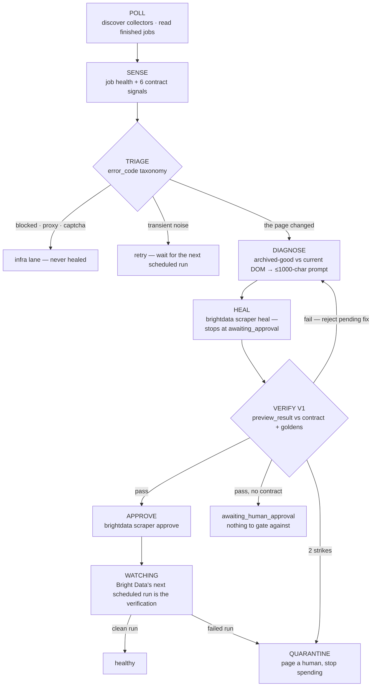

# ANANSI

**An immune system for your scraper fleet.**

Bright Data's Scraper Studio can heal a broken scraper — but only after a human notices the
breakage, writes the diagnosis in plain English, and approves the fix. ANANSI closes that loop:
it notices (including when a scraper returns *plausible wrong data* with no error), writes the
diagnosis itself from a DOM diff, drives Bright Data's own healer, verifies the proposed fix
against pinned golden records, and only then promotes it. Every incident is logged, costed, and
reversible.

ANANSI is a **monitor, not a scheduler**. It never triggers a collection: Bright Data owns the
schedule, and ANANSI polls the platform for runs that already happened. The fleet is
auto-discovered from the account, so a scraper built in Studio is watched with no config edit,
and a data contract is an optional overlay that adds goldens on top of platform-failure
monitoring. See [ADR-004](docs/decisions/004-monitor-not-scheduler.md).

Built for **Into the Scrape-Verse** (WeMakeDevs × Bright Data, Aug 17–23, 2026).

> One-line pitch: *Bright Data made scrapers that can heal. Anansi makes scrapers that know
> they're sick — and can prove the cure worked.*

## Demo video

**Link: TBD** — recorded during build week; beat-by-beat script in
[docs/demo-script.md](docs/demo-script.md). The kill shot at 0:40 is L3: the index's product
links go JS-driven, every card still matches `a.card-link`, and every one now resolves to the
index itself. Stage 2 scrapes the same page four times — the right NUMBER of rows, all of
them the wrong page — and the job reports SUCCESS throughout. A row-count check passes and
the data is entirely wrong.

### Screenshots

<!-- screenshot: console — incident trace (vertical stage timeline, heal attempts + duration per node) -->
<!-- screenshot: console — split diff (last-good DOM vs mutated DOM beside the proposed code diff) -->
<!-- screenshot: Mutation Lab /__control panel, one button per mutation -->
<!-- screenshot: Scraper Studio IDE with scraper/lab-scraper.js source (tag_html / collect visible) -->

## The loop



Full walkthrough in [docs/architecture.md](docs/architecture.md); the six detection signals
and the goldens discipline in [docs/data-contract.md](docs/data-contract.md). Post-approval
regression checking used to be a second synthetic sweep ("verify V2"); it is now the next real
scheduled run — [ADR-005](docs/decisions/005-verify-v2-dropped.md).

## Quickstart

```bash
npm install
npm test                 # 166 offline tests: sense/verify engines, monitor, archive, Lab, adapters

npm run lab              # Mutation Lab on :4600 — break it from /__control
npx tsx scripts/seed-demo.ts   # drive a full M2 incident through the fake adapter

npm --prefix apps/console-ui install && npm run ui:build   # build the React console (once)
npm run console          # console on :4700 — React SPA if built, SSR fallback if not

# The monitor always reads job history over REST, so BRIGHTDATA_API_KEY is required.
# ANANSI_ADAPTER selects the HEAL seam only.
BRIGHTDATA_API_KEY=... ANANSI_ADAPTER=fake npm run monitor   # real reads, banked heals — no credits
BRIGHTDATA_API_KEY=... npm run monitor                        # the real thing (brightdata CLI logged in)
```

Hosting it: `docker compose up --build` runs the whole stack (Lab, console, agent), and
[docs/deploy-coolify.md](docs/deploy-coolify.md) is the Coolify walkthrough — two public URLs,
one for the storefront and one for the console.

Everything develops fixture-first: `ANANSI_ADAPTER=fake` swaps in a heal adapter that replays
banked `heal.json` responses, so the gates and tests spend no credits and never write to the
platform. Only the *write* side has a fake — there is nothing worth faking about reading job
history, so the read client is always the real REST one. The real path additionally needs the
`brightdata` CLI logged in; pinning goldens to a discovered scraper needs its `collector_id` in
[contracts/lab-storefront.yaml](contracts/lab-storefront.yaml), but a collector with no contract
is still discovered and still monitored for platform failures.
`examples/structured-output.json` shows the scraper's collected rows and a closed incident
record (Rule 9).

## How Bright Data Scraper Studio is used

Scraper Studio is not an integration here — it is the substrate. Every stage of the loop is
built from a Studio primitive:

| Studio primitive | How ANANSI uses it | Where |
|---|---|---|
| `scraper create` | The scraper is hand-authored — interaction + parser code written for the Studio IDE, not generated | [scraper/lab-scraper.js](scraper/lab-scraper.js) |
| Collector + job REST API | Read-only: `GET /dca/collectors_list` discovers the fleet, `GET /dca/collector/jobs` reads runs Bright Data already performed, `GET /dca/dataset` reads their rows. ANANSI never triggers a collection | [packages/adapters/brightdata/api.ts](packages/adapters/brightdata/api.ts), [apps/agent/monitor.ts](apps/agent/monitor.ts) |
| `tag_html()` snapshots | Tagged on every page load; Scraper Studio surfaces the tag as a `page_html` output field (plus an auto-added `page_html_url`), which the adapter seam normalises. Most scrapers collect no snapshot, so ANANSI also keeps its own free plain-GET archive — the stored last-good/current pair is what feeds the DOM diff | [scraper/lab-scraper.js](scraper/lab-scraper.js), [apps/agent/archive.ts](apps/agent/archive.ts), [packages/core/diagnose/](packages/core/diagnose/) |
| `error_code` taxonomy | Every code routes to a triage lane: **heal** (the page changed) · **infra** (`blocked`, `proxy*` — never healed, [ADR-003](docs/decisions/003-blocked-never-healed.md)) · **retry** · **dead** · **config**. Per-input codes arrive inside dataset rows, not only on the job | [packages/core/sense/triage.ts](packages/core/sense/triage.ts), [docs/brightdata-notes.md](docs/brightdata-notes.md) |
| `scraper heal` | Driven with an **auto-generated prompt** built from the DOM diff — symptom, located change, expected output — hard-capped at the CLI's 1000 chars. Never `--auto-approve` | [packages/core/diagnose/prompt.ts](packages/core/diagnose/prompt.ts), [apps/agent/incident.ts](apps/agent/incident.ts) |
| `awaiting_approval` + `preview_result` | Heal stops at the platform's own gate; V1 judges the preview rows (attributable via the collected `input.url`) against contract, invariants, goldens, and a hardcode detector | [packages/core/verify/v1.ts](packages/core/verify/v1.ts) |
| `scraper approve` / `--reject` | Approve only after V1 passes; a failed V1 **rejects the pending fix first** (the CLI's documented retry flow), then re-heals with the failure in evidence. With no contract to gate against, the fix is left `awaiting_approval` for a human | [apps/agent/incident.ts](apps/agent/incident.ts), [ADR-002](docs/decisions/002-approval-gate-stays.md) |
| `collector_id` | The fleet's identity: discovered from the platform, optionally joined to a contract, and threaded across store state, incident records, and console views | [contracts/lab-storefront.yaml](contracts/lab-storefront.yaml), [apps/agent/main.ts](apps/agent/main.ts), [packages/adapters/store/index.ts](packages/adapters/store/index.ts) |

The **write** side goes through a single adapter interface implemented twice:
[packages/adapters/brightdata/real.ts](packages/adapters/brightdata/real.ts) shells out to the
`brightdata` CLI; [packages/adapters/brightdata/fake.ts](packages/adapters/brightdata/fake.ts)
replays banked fixtures. That interface has no run/trigger method at all, which is what makes
"ANANSI never starts a collection" a compile error rather than a code-review catch. The **read**
side is [packages/adapters/brightdata/api.ts](packages/adapters/brightdata/api.ts) and is always
real.

## Judging criteria → where to look

| Criterion | Where to look |
|---|---|
| "Solves a clear, useful problem" | The silent-lie failure mode: a scraper returning 200 + valid JSON + a wrong number. [docs/mutations.md](docs/mutations.md) M2, the golden-band signal in [packages/core/sense/goldens.ts](packages/core/sense/goldens.ts), video 0:00–1:00 |
| "Original approach to web-data collection" | First closure of Bright Data's *own* heal workflow into an autonomous gated loop, with the diagnosis prompt auto-written from a DOM diff ([packages/core/diagnose/prompt.ts](packages/core/diagnose/prompt.ts)). Prior art sized honestly below |
| "Complete, reliable, well-structured implementation" | Pure core / adapter shell ([docs/architecture.md](docs/architecture.md)) · 166 offline tests (`npm test`, [test/](test/)) · pre-declared scope tiers ([CUTS.md](CUTS.md)) · 5 ADRs ([docs/decisions/](docs/decisions/)) |
| "Bright Data Scraper Studio central" | The table above — every loop stage is a Studio primitive; [scraper/lab-scraper.js](scraper/lab-scraper.js) is hand-authored for the Studio IDE |
| "Accounts for site changes, missing data, extraction failures" | The Mutation Lab ([apps/ui/](apps/ui/), [docs/mutations.md](docs/mutations.md)) breaks the site on demand; job-health classification plus 6 contract signals and triage lanes ([docs/data-contract.md](docs/data-contract.md), [packages/core/sense/triage.ts](packages/core/sense/triage.ts)); quarantine + rollback paths |
| "Demo explains problem, workflow, structured output, product" | [docs/demo-script.md](docs/demo-script.md) beat by beat; [examples/structured-output.json](examples/structured-output.json) (collected rows + closed incident record); the console screens |

## Folder map

| File | What it is |
|---|---|
| [docs/architecture.md](docs/architecture.md) | The five-stage loop, component boundaries, adapter design |
| [docs/data-contract.md](docs/data-contract.md) | Contract schema, detection signals, golden records |
| [docs/mutations.md](docs/mutations.md) | Mutation Lab spec — the 3 shipping mutations + stretch |
| [docs/brightdata-notes.md](docs/brightdata-notes.md) | Verified platform facts: CLI, REST API, latency, credits, error routing |
| [docs/runbook.md](docs/runbook.md) | Day-by-day build schedule, plus the operator procedures |
| [docs/deploy-coolify.md](docs/deploy-coolify.md) | Hosting: three containers, two public URLs |
| [docs/demo-script.md](docs/demo-script.md) | The 3-minute video, beat by beat, with fallback strategy |
| [docs/prep-checklist.md](docs/prep-checklist.md) | Everything to finish before Aug 17 |
| [docs/decisions/](docs/decisions/) | ADRs — drafted now so writing them later is transcription |
| [CUTS.md](CUTS.md) | Pre-declared scope tiers — the cuts are decided while calm |
| `packages/core/` | Pure engines: sense (job health + 6 contract signals) · diagnose (DOM diff → prompt) · verify (the V1 gate) |
| `packages/adapters/` | The only I/O: Bright Data read API + write CLI (real + fixture fake) · store · LLM |
| `apps/agent/` | Monitor (poll, classify, archive) + incident driver |
| `contracts/` | Optional per-scraper data contracts: canaries, goldens, invariants, `collector_id` |
| `apps/ui/` | Mutation Lab storefront (Dockerfile + vercel.json) — see [docs/mutations.md](docs/mutations.md) |
| `apps/console/` | Console server: fleet, runs, incident trace + split diff (SSR fallback) |
| `apps/console-ui/` | React SPA for the console (Vite; served by `apps/console/` once built) |
| `scraper/` | Hand-authored Scraper Studio source (Rule 5) |
| `scripts/` | `seed-demo.ts` — seeds a full fixture incident for console work and video prep |
| `test/` | 166 offline tests over sense, diagnose, verify, the monitor, the archive, the console and the Lab |
| `examples/` | Committed example structured output (Rule 9) |

## The claim, sized honestly

Self-healing scraping is not a new category — Kadoa ships a commercial loop, and the academic
field of wrapper verification (Kushmerick, AAAI 1999) described distributional output-checking
twenty years ago. ANANSI's delta is specific: it is the first system to close **Bright Data's
own** heal workflow — `scraper heal` / `scraper approve`, which today require a human at every
step — into an autonomous, gated, verified loop built natively from Scraper Studio primitives
(`tag_html` snapshots, the `error_code` taxonomy, the approval gate). Prior art is cited, not
hidden.

## AI usage disclosure

Hackathon Rule 10 requires disclosure of AI-assistant use. This project is planned and will be
built with AI coding assistants (Claude). The architecture, statistical design (tolerance bands
+ CUSUM over PSI — see [ADR-001](docs/decisions/001-why-not-psi.md)), verification-gate logic,
and all Scraper Studio scraper code are human-designed and human-understood; the ADRs exist so
every load-bearing decision can be defended out loud. The LLM that generates heal prompts at
runtime is a *product feature*, distinct from development tooling.
