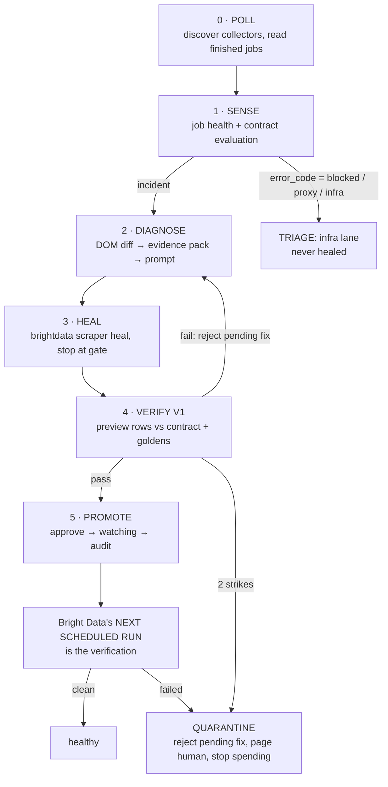

# Architecture

## The loop



Three structural rules the whole design hangs on:

1. **ANANSI never triggers a collection.** Bright Data owns the schedule; ANANSI reads what
   that schedule produced. The write-side adapter interface has no run/trigger method, so a
   scrape-starting code path is a compile error rather than a review catch
   ([ADR-004](decisions/004-monitor-not-scheduler.md)).
2. **Pure core, imperative shell.** `packages/core/sense/`, `diagnose/`, `verify/` are pure
   functions over plain data — no network, no clock, no I/O. Anything that talks to the world
   lives in an adapter at the edge.
3. **The two Bright Data seams are separate.** *Reads* (collectors, jobs, job logs, datasets)
   go through the REST client, which is always real — there is nothing worth faking about
   reading history. *Writes* (heal / approve / reject) go through one adapter interface
   implemented twice: `real` (shells out to the `brightdata` CLI) and `fake` (replays banked
   fixtures). The fake is not a testing nicety — it is the only way to develop against a heal
   backend that takes 5–25 minutes per answer.

## Components

```
anansi/
├── packages/core/
│   ├── sense/        # job health, contract checks, tolerance bands, CUSUM, invariants (pure)
│   ├── diagnose/     # DOM normalize + diff, evidence pack, prompt builder            (pure)
│   └── verify/       # golden-record check, hardcode detector, confidence            (pure)
├── packages/adapters/
│   ├── brightdata/   # api.ts = read-only REST · real.ts/fake.ts = heal/approve/reject/budget
│   ├── llm/          # diagnosis prose generation from evidence pack
│   └── store/        # snapshots, run history, job ledger, audit log (JSON files)
├── apps/agent/
│   ├── monitor.ts    # poll loop, fleet discovery, job ledger, state machine
│   ├── archive.ts    # free plain-GET HTML archive (the diff's last-good source)
│   └── incident.ts   # drives one incident through stages 2–5
├── apps/console/     # fleet · runs · incident trace · split diff (SSR fallback)
├── apps/console-ui/  # React SPA for the console
├── apps/ui/          # Production Mutation Lab at anansi-lab.akshatkatiyar.com
└── docs/decisions/   # ADRs
```

## Data flow, one incident

1. The monitor polls. `GET /dca/collectors_list` discovers the fleet — a scraper built in
   Studio appears with no config edit — and `GET /dca/collector/jobs` is then called **per
   collector** (the `collector` param is required; see brightdata-notes.md). Jobs already seen
   are skipped via the persisted ledger, so a restart never replays one. A contract, if one is
   pinned for that `collector_id`, is an overlay: without it the collector is still monitored
   for platform failures.
2. A finished job is classified by `sense/job-health.ts` before any contract runs. Failure is
   the disjunction of `failed_pages > 0`, `fails > 0`, `success_rate < 1`, row-level
   `error`/`error_code`, and status only when present and terminal — a live job was observed
   reporting no status at all with 15 failed pages.
3. `GET /dca/dataset` returns the job's rows. `splitRow()` at the adapter seam normalises row
   identity (`input` / `prime_input` / `url`), lifts per-row errors, and strips any snapshot
   field so a 15KB HTML document never reaches contract evaluation as if it were a value.
4. `sense.evaluate(records, contract, history)` → `Incident | Healthy`. An Incident carries:
   failing fields, signal class (hard-fail / contract / fill-rate / band / CUSUM / invariant),
   raw records, snapshot refs.
5. `diagnose.evidence(lastGoodSnapshot, currentSnapshot, incident)` → normalized DOM diff of
   the relevant subtree + structured evidence pack. LLM adapter turns the pack into the
   plain-English heal prompt. **Prompt is auto-generated — this is the novel step.**
6. `brightdata.heal(collectorId, prompt, {timeout: 1800})` → `{status: "awaiting_approval",
   preview_result, diff_summary}`. Never `--auto-approve` at the CLI level — the gate is ours.
   Prompt is hard-capped at **1000 chars** (CLI limit): symptom, located change, expected
   output — never the raw diff. The LLM adapter enforces this with a truncate-and-retry guard.
7. **V1, pre-approval**, on `preview_result`: contract clean · invariants hold · golden check
   for any row attributable via its `input.url` field · hardcode detector. The CLI's `--url` on
   heal is cosmetic ("not sent to the heal call"), so `preview_result` is backend-chosen sample
   rows; the gate judges what it is actually given.
8. V1 pass → approve, collector moves to `watching`. V1 fail → `brightdata.reject()` the pending
   fix (mandatory — the CLI's documented retry flow is reject-then-re-heal; a dangling
   awaiting_approval fix could be promoted by a stray manual approve), then back to 5 with the
   failure appended to the evidence pack. Two failures → reject pending fix, quarantine + human
   page. Audit record written in every path (evidence, prompt, diff, verdict, wall-clock, heal
   attempts). A collector with **no contract** has nothing to gate against, so V1 cannot pass
   it: the fix is left `awaiting_approval` and a human decides.
9. **Verification is Bright Data's next scheduled run** ([ADR-005](decisions/005-verify-v2-dropped.md)).
   The monitor watches for the next terminal job on a `watching` collector: clean → `healthy`;
   failed → `quarantined` **without a second heal attempt**, since a fix that broke the first
   real run after promotion is not a candidate for another AI generation. Rollback is the
   Versions menu (**dashboard-only — there is no CLI rollback**; ANANSI flags, a human clicks).

### The HTML archive

Dataset rows carry page HTML only if the scraper happened to `tag_html()` it, and there is no
API to read a scraper's source to find out. So ANANSI fetches the target URL itself with a
plain HTTP GET — free, because it never touches Bright Data — and archives that HTML after
every successful job. On a failure it fetches again and diffs archived-good against current.

**Documented limitation:** a plain GET is not Bright Data's browser rendering through its proxy
network. On a JS-heavy page we see a shell the scraper never parsed; on a geo-gated or
challenged page we see our own block, not the scraper's. Such captures are marked
low-confidence rather than passed off as the product page, because a diff against a captcha
produces a confident, wrong heal prompt. The 403 → `blocked` / 404 → `dead_page` / 5xx → retry
mapping is the platform's own taxonomy, applied to our own fetch.

### Per-collector state machine

`healthy → incident_open → healing → watching → (healthy | quarantined)`.
The monitor **dispatches work only for collectors in `healthy`/`watching`** — otherwise a job
finishing during a 5–25 min heal opens a duplicate incident, spends another AI generation, and
eats the 3-wide cap. Work that cannot be dispatched is **deferred with its payload**, never
dropped: unlike a cadence tick, nothing regenerates a job. Owned by `monitor.ts` + `incident.ts`
over shared store state. On restart, a collector left `healing` is quarantined rather than
resumed, because the monitor cannot know whether a fix is sitting awaiting_approval on the
platform. `verifying` survives in the state union with no producer so pre-pivot incidents still
render.

### Goldens are an immutable anchor

Promotion does **not** re-pin goldens. The hand-pinned value stays the reference; a correct
heal fixes the selector, so the true value has not changed and the old golden must still match.
(Auto-re-pin would launder the degenerate hardcode-the-golden heal that ADR-002 warns about,
and ratchet the reference away from ground truth.) The re-pin *flag* — "promoted value inside
the band but >2% off the anchor, ask a human" — was produced only by verify V2 and is gone with
it; drift is now caught when it leaves the band or trips CUSUM, later and less specifically
([ADR-005](decisions/005-verify-v2-dropped.md)). Cheap hardcode detector in V1 survives: the
preview value must appear in the current DOM snapshot's changed subtree — a hardcoded value
that isn't in the DOM fails.

## Incident record (audit log shape)

Immutable, append-only. One record per incident:
`{id, scraper, opened_at, signal, evidence_ref, prompt, heal_attempts: [{diff_summary,
verdict, confidence}], resolution: promoted|quarantined|infra|dead, credits_spent,
wall_ms, approved_by: gate|human}`

ANANSI causes no page loads, so `credits_spent` counts **heal attempts** — the only spend it can
still initiate — and the console labels it as such. `resolution` also keeps the legacy
`rolled_back` value so incidents recorded before ADR-005 still render. This is the
"reliability" criterion made visible — the console renders it as the incident trace.

## Console

- **Fleet** — every discovered collector, contract-backed or not. A contract-less card gets a
  run-outcome strip and a `platform signals only` chip instead of a golden sparkline, so a
  missing contract is visible rather than implied.
- **Runs** — the platform's job history as ANANSI observed it, never a list of things ANANSI
  did. `j_` ids render as *scheduled*, `vj_` as *cli/realtime*: the visible proof the schedule
  is not ours.
- **Incident trace** — the vertical stage timeline, live state, duration + heal attempts per
  node, evidence expandable inline. Stage 6 reads `AWAITING THE NEXT SCHEDULED RUN`.
- **Split diff** — archived last-good DOM beside current DOM, changed subtree highlighted, next
  to the code diff Scraper Studio proposed. Cause and fix, side by side. The best screen we own.
- The console is strictly read-only: a test forbids any console file from importing a Bright
  Data client or calling `runSync`/`runBatch`/`trigger`.
