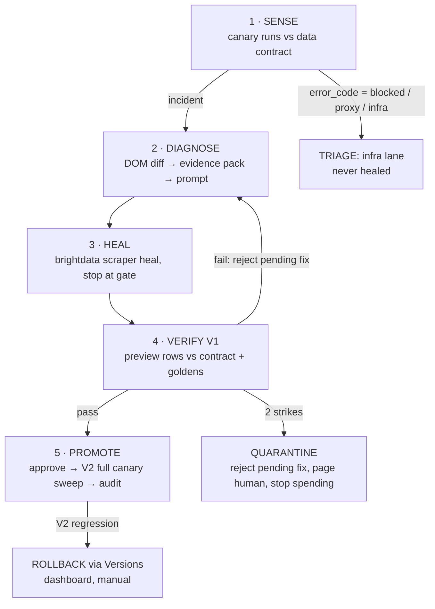

# Architecture

## The loop



Two structural rules the whole design hangs on:

1. **Pure core, imperative shell.** `sense/`, `diagnose/`, `verify/` are pure functions over
   plain data — no network, no clock, no I/O. Anything that talks to the world lives in an
   adapter at the edge.
2. **Every Bright Data call goes through one adapter interface**, implemented twice: `real`
   (shells out to the `brightdata` CLI as a subprocess) and `fake` (replays banked fixtures).
   The fake adapter is not a testing nicety — it is the only way to develop against a heal
   backend that takes 5–25 minutes per answer.

## Components

```
anansi/
├── core/
│   ├── sense/        # contract checks, tolerance bands, CUSUM, invariants  (pure)
│   ├── diagnose/     # DOM normalize + diff, evidence pack, prompt builder  (pure)
│   └── verify/       # golden-record check, regression check, confidence    (pure)
├── adapters/
│   ├── brightdata/   # CLI subprocess wrapper: run / heal / approve / reject / budget
│   ├── llm/          # diagnosis prose generation from evidence pack
│   └── store/        # snapshots, run history, audit log (SQLite or JSON files)
├── shell/
│   ├── scheduler.ts  # canary cadence, budget guard, quarantine state
│   └── incident.ts   # drives one incident through stages 2–5
├── console/          # 2 views: incident trace + split diff; fleet strip header
├── lab/              # Mutation Lab — separate deploy (see mutations.md)
└── docs/decisions/   # ADRs
```

## Data flow, one incident

1. Scheduler fires a canary sweep — 3–5 individual `scraper run --sync` calls (`--sync` is
   single-URL; multiple URLs route to the async batch endpoint). The run output carries two
   extra fields beyond the contract's: the `tag_html()` DOM capture, which Studio surfaces
   under the tag's own name (`page_html`, alongside an auto-added `page_html_url`), and
   `input.url` (so every row, including heal preview rows, is attributable to a canary).
   `splitRow()` at the adapter seam normalises the snapshot key and strips it, so snapshots
   are stored but never reach contract evaluation.
2. `sense.evaluate(records, contract, history)` → `Incident | Healthy`. An Incident carries:
   failing fields, signal class (hard-fail / contract / fill-rate / band / CUSUM / invariant),
   raw records, snapshot refs.
3. `diagnose.evidence(lastGoodSnapshot, currentSnapshot, incident)` → normalized DOM diff of
   the relevant subtree + structured evidence pack. LLM adapter turns the pack into the
   plain-English heal prompt. **Prompt is auto-generated — this is the novel step.**
4. `brightdata.heal(collectorId, prompt, {timeout: 1800})` → `{status: "awaiting_approval",
   preview_result, diff_summary}`. Never `--auto-approve` at the CLI level — the gate is ours.
   Prompt is hard-capped at **1000 chars** (CLI limit): symptom, located change, expected
   output — never the raw diff. The LLM adapter enforces this with a truncate-and-retry guard.
5. **Verify runs in two phases** — the CLI's `--url` on heal is cosmetic ("not sent to the
   heal call"), so `preview_result` is backend-chosen sample rows; a multi-canary check
   cannot run pre-approval:
   - **V1 · pre-approval**, on `preview_result`: contract clean · invariants hold · golden
     check for any row attributable via its `input.url` field. (D1 smoke test: try
     `scraper run <id> <canary> --version dev` while a fix is pending — if the dev version
     runs the heal candidate, V1 upgrades to a full canary sweep before production exposure.)
   - **V2 · post-approval, before the incident closes**: `brightdata.approve()`, then
     immediately run the full 3–5 canary sweep — goldens · no new drift · **regression check**
     (fields that weren't broken still aren't) all evaluated here, where every row has a URL.
6. V1 pass → approve + V2. V1 fail → `brightdata.reject()` the pending fix (mandatory — the
   CLI's documented retry flow is reject-then-re-heal; a dangling awaiting_approval fix could
   be promoted by a stray manual approve), then back to 3 with the failure appended to the
   evidence pack. Two failures → reject pending fix, quarantine + human page. Audit record
   written in every path (evidence, prompt, diff, verdict, wall-clock, credits).
7. V2 fail → roll back via the Versions menu (**dashboard-only — there is no CLI rollback**;
   ANANSI auto-detects, a human clicks) and quarantine. V2 pass → incident closed; next N
   canary runs still watched as a backstop.

### Per-collector state machine

`healthy → incident_open → healing → verifying → watching → (healthy | quarantined)`.
The scheduler **skips incident-opening canary sweeps** for any collector not in
`healthy`/`watching` — otherwise a 30-min cadence firing during a 5–25 min heal opens a
duplicate incident, burns credits, and eats the 3-wide AI-generation cap. Owned by
`scheduler.ts` + `incident.ts` over shared store state.

### Goldens are an immutable anchor

Promotion does **not** re-pin goldens. The D1 hand-pinned value stays the reference; a
promoted heal whose verified value differs from the anchor beyond a small epsilon flags for
human re-pin instead of silently updating. (Auto-re-pin would launder the degenerate
hardcode-the-golden heal that ADR-002 warns about, and ratchet the reference away from ground
truth.) Cheap hardcode detector in V1: the preview value must appear in the current DOM
snapshot's changed subtree — a hardcoded value that isn't in the DOM fails.

## Incident record (audit log shape)

Immutable, append-only. One record per incident:
`{id, scraper, opened_at, signal, evidence_ref, prompt, heal_attempts: [{diff_summary,
verdict, confidence, gates}], resolution: promoted|quarantined|rolled_back, credits_spent,
wall_ms, approved_by: gate|human}`

This is the "reliability" criterion made visible — the console renders it as the incident
trace, and `credits_spent` per incident is the line sponsor judges remember.

## Console (two screens, done well)

- **Incident trace** — the vertical stage timeline, live state, duration + credit cost per
  node, evidence expandable inline.
- **Split diff** — last-good DOM beside current DOM, changed subtree highlighted, next to the
  code diff Scraper Studio proposed. Cause and fix, side by side. The best screen we own.
- Fleet is a header strip (name · status pill · last-checked), not a grid. Polling with a good
  loading state; SSE only if the trace feels dead without it.
